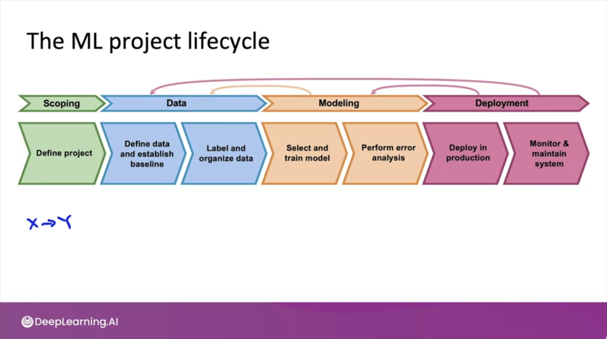
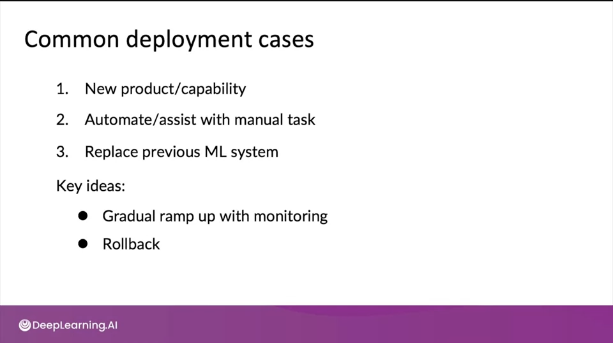

### ML project lifecycle

- 4 단계로 나누어 진다.
    - Scoping
        - project 문제를 정의한다.
        - X는 무엇이고 Y는 무엇인가?
    - Data
        - data를 정의하고 label을 지정한다.
    - Modeling
        - 모델을 선택하고 훈련시킨다.
        - error analysis를 하고 개선시킨다.
    - Deployment
        - production에서 배포한다.
        - 시스템을 모니터링하고 유지한다.
            - 데이터 분포가 변경되면, 모델과 데이터도 그에 맞게 변경해야할지도 모른다.
- 위의 과정들은 iterative하게 진행된다. 예를 들면, modeling을 하다가 data를 하거나 deployment를 하다가 modeling을 하기도 한다.

### Concept Drift, Data Drift
- ML project는 데이터 변화에 대응해야 한다.
    - COVID-19로 사람들의 온라인 쇼핑이 늘었다. 그래서 사람들이 온라인 결제를 하는 방식이 바뀌었고, 많은 사람들이 사기 방지 시스템에 걸려 결제를 못했다고 한다.
- Concept Drift는 X->Y에서 Y가 변하는 것이다. 
    - 예를 들면 집 크기로 집값을 예측하는 문제가 있다고 하자. 인플레이션이나 시장의 변화로 같은 크기의 집에 대해 집값이 올라갈 수 있다.
- Data Drift는 X->Y에서 X의 분포가 변하는 것이다.
    - 사람들이 더 작은 집을 많이 짓기 시작한다면? 혹은 더 큰 집을 선호한다면? 집 크기 데이터의 분포가 달라질 것이다.

### Deployment

- Shadow mode deployment
    - 기존 기능을 그대로 유지하면서 모델을 배포하는 것
    - 모델의 예측값은 의사결정에 쓰이지 않음
- Canary Deployment
    - ML 알고리즘이 실제로 적용되어도 괜찮다고 판단되면, 일반적오르 시도할 수 있는 배포 패턴
    - 실제 트래픽의 일부(e.g. 5%)를 ML 모델로 돌려서 배포해보는 것
- Blue Green Deployment
    - 새로 개발한 모델: Green, 기존 모델: Blue
    - 라우터가 Green을 바라보게해서 Green이 작동하도록 한다.
    - 만약 문제가 생기면 라우터가 다시 Blue를 바라보게 해서 기존 시스템을 작동시킨다.
    - 한꺼번에 전환하지 않고 점진적으로 전환해도 된다.