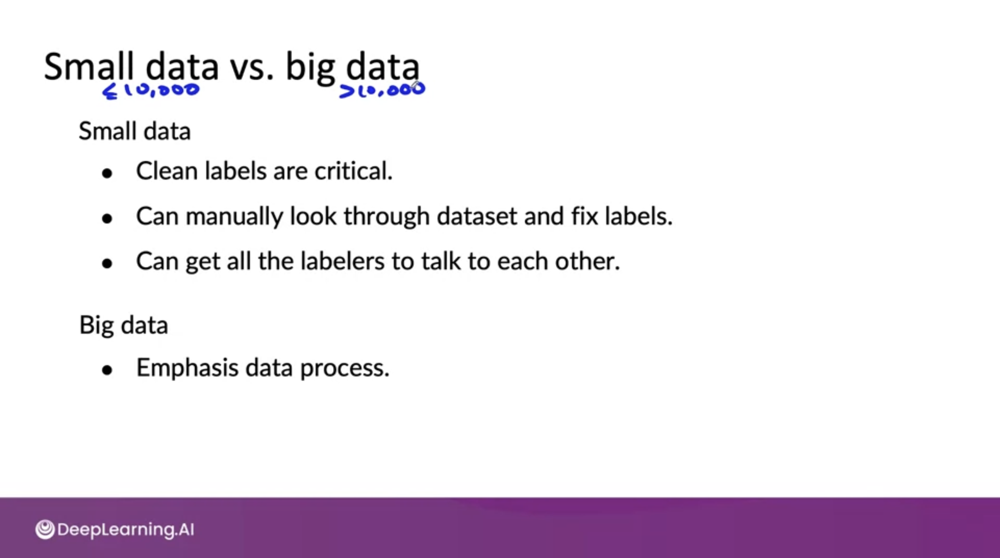
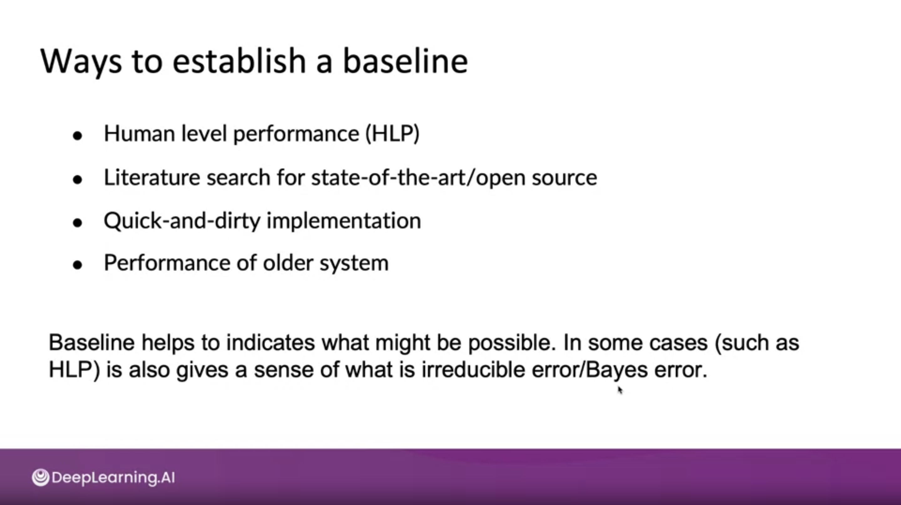

### Why is data definition hard?

- small data vs big data
    - small data는  clean labels가 중요하고
    - 직접 데이터셋을 확인하고 라벨을 수정할 수 있으며
    - 라벨러들이 서로 이야기를 나눌 수 있다.
    - 하지만, 빅데이터에선 데이터 프로세스가 중요하다.

- Baseline의 중요성
    - 정확도가 중요한 게 아니다.
        - 만약 99%가 True, 1%가 False인 질병 예측 문제가 있다면, 99%의 정확도를 갖는 모델이 좋은 모델일까? 
        - 항상 True를 제출하기만 해도 99%의 정확도를 갖게 된다.
        - 이런 경우F1 score가 유용하게 사용될 수 있다.
    - Baseline 모델을 두고 비교하는 게 좋은 시작이 된다.
        - HLP(Human Level Performance), Open source model, 다른 사람들의 모델 등을 baseline으로 사용할 수 있다.

#### 참고 자료
- [Baselines](https://blog.ml.cmu.edu/2020/08/31/3-baselines/)