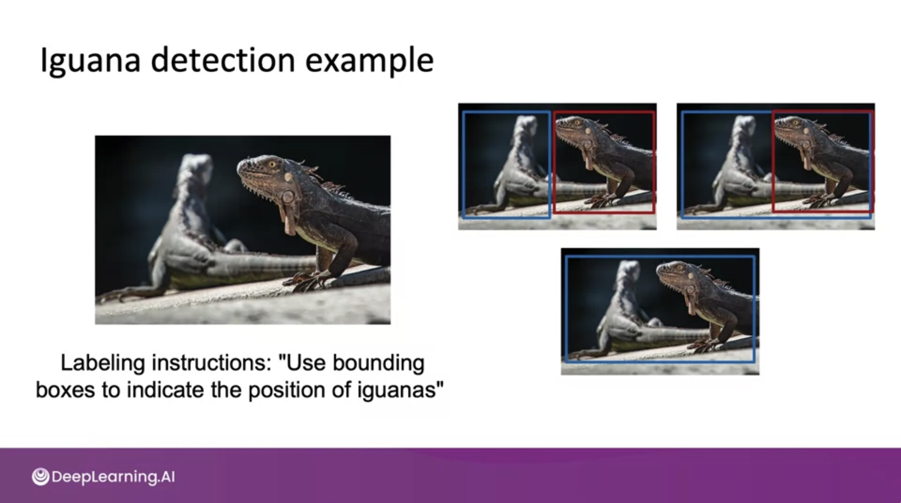

#### Why is data definition hard?

- 데이터 라벨링의 모호함(labeling ambiguity)이 있을 수 있다
    - 위의 이구아나 사진을 보면 알 수 있듯, 같은 라벨링 과제라도 여러 방법이 있을 수 있다.

- small data vs big data
    - small data는  clean labels가 중요하고
    - 직접 데이터셋을 확인하고 라벨을 수정할 수 있으며
    - 라벨러들이 서 로 이야기를 나눌 수 있다.
    - 하지만, 빅데이터에선 데이터 프로세스가 중요하다.

#### 참고 자료
- [Building a data pipeline](https://cs230.stanford.edu/blog/datapipeline/#best-practices)
