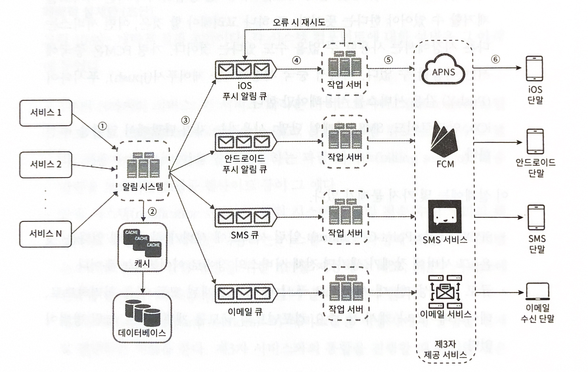

## 알림 시스템을 설계해보자!

- 알림 시스템은 최근 많은 프로그램이 채택한 인기 있는 기능이다.
- 이 기능을 갖춘 프로그램은 최신 뉴스, 제품 업데이트, 이벤트, 선물 등 고객에게 중요할 만한 정보를 비동기적으로 제공한다.

## 1 단계. 문제 이해 및 설계 범위 확정

- 푸시 알림, SMS 메시지, 이메일 알림 지원
- soft real-time 시스템. 약간의 지연은 무방
- iOS 단말, 안드로이드 단말, 랩톱/데스크톱 지원
- 클라이언트 프로그램이 알림을 만들거나, 서버 측에서 스케줄링하여 알림을 만듦
- 사용자가 알림을 받지 않도록 설정 가능
- 하루에 천만 건의 모바일 푸시 알림, 백만 건의 SMS 메시지, 5백만 건의 이메일

## 2 단계. 개략적 설계안 제시 및 동의 구하기

- 알림 유형별 지원 방안
    - iOS 푸시 알림
        - 알림 제공자, APNS(애플이 제공하는 원격 서비스), iOS 단말로 이루어짐
    - 안드로이드 푸시 알림
        - 알림 제공자, FCM(Firebase Cloud Messaging), 안드로이드 단말로 이루어짐
    - SNS 메시지
        - 알림 제공자, SMS 서비스(트윌리오, 넥스모 등), SMS 수신 단말로 이루어짐
    - 이메일
        - 알림 제공자, 이메일 서비스(센드그리드, 메일침프 등), 이메일 수신 단말로 이루어짐

- 연락처 정보 수집 절차
    - 사용자 단말 - 계정 등록 → 데이터베이스에 연락처 정보 저장
    
- 개략적 설계안
    - 1부터 N까지의 서비스: 알림 시스템에 알림을 전송할 각종 서비스들
    - 알림 시스템: 알림 전송을 위한 API 제공, 제 3자 서비스에 전달할 알림 페이로드 제작
    - 제 3자 서비스: FCM, 트윌리오 등 실제로 알림을 전달하는 서비스들
        - 확장성을 고려해야 한다. 쉽게 새로운 서비스를 통합하거나 기존 서비스를 제거할 수 있어야 한다
    - iOS, 안드로이드, SMS, 이메일 단말

- 문제점
    - SPOF: 알림 서비스에 서버가 하나밖에 없으면, 장애가 전체 서비스의 장애로 이어진다
    - 규모 확장성: 데이터베이스나 캐시 등 중요 컴포넌트의 규모를 개별적으로 늘릴 방법이 없다.
    - 성능 병목: 모든 것을 한 서버로 처리하면 트래픽이 몰릴 때 과부하 상태에 빠질 수 있다.

- 개선된 설계안
    - 데이터베이스와 캐시를 알림 시스템의 주 서버에서 분리한다
    - 알림 서버를 증설하고 자동으로 수평적 규모 확장이 이루어 질 수 있도록 한다
    - 메시지 큐를 이용해 시스템 컴포넌트 사이의 강한 결합을 끊는다
    - 알림 서버는 다음을 제공한다.
        - 알림 전송 API
        - 알림 검증: 이메일 주소, 전화번호 등에 대한 기본적 검증
        - 데이터베이스 또는 캐시 질의
        - 알림 전송: 알림 데이터를 메시지 큐에 넣는다
    - 캐시
    - 데이터베이스
    - 메시지 큐: 시스템 컴포넌트 간 의존성을 제거하기 위해 사용한다
    - 작업 서버: 메시지 큐에서 전송할 알림을 꺼내서 제 3자 서비스로 전달하는 역할을 담당한다
        
        
    
 

## 3단계 상세 설계

- 안정성
    - 데이터 손실 방지
        - 알림 데이터를 데이터베이스에 보관하고 재시도 메커니즘을 구현한다.
        - 알림 로그 데이터베이스를 유지한다.
    - 알림 중복 전송 방지
        - 중복 방지 로직을 적용한다.
        - 보내야 할 알림이 도착하면 그 이벤트 ID를 검사하여 중복 이벤트인지 검사한다.
    - 알림 템플릿
        - 하루에도 수백만 건 이상의 알림을 처리한다. 알림 템플릿은 유사성을 고려하여 알림 메시지의 모든 부분을 처음부터 다시 만들 필요 없도록 해준다.
    - 알림 설정
        - 알림 설정 테이블에 사용자가 설정한 알림 설정을 저장한다.
        - 특정 종류의 알림을 보내기 전에 해당 사용자가 해당 알림을 켜 두었는지 확인한다
    - 전송률 제한
        - 사용자가 받을 수 있는 알림 빈도를 제한한다.
    - 재시도 방법
        - 알림을 재시도 전용 큐에 넣는다.
        - 같은 문제가 계속 발생하면 개발자에게 통지한다.
    - 푸쉬 알림과 보안
    - 큐 모니터링
        - 큐에 쌓인 알림의 개수를 모니터링하고, 적절하게 작업 서버의 수를 조절할 수 있게 한다.
    - 이벤트 추적
        - 알림 확인율, 클릭율, 실제 앱 사용으로 이어지는 비율 등을 추적할 수 있게 한다.
        - 보통 데이터 분석 서비스와 통합해야 한다.

    ## 4단계 마무리

    - 아래 주제에 집중하였다.
        - 안정성
            - 메시지 전송 실패율을 낮추기 위해 안정적인 재시도 메커니즘을 도입하였다
            - 보안: 인증된 클라이언트만 알림을 보낼 수 있도록 appKey, appSecret 등의 메커니즘을 이용하였다.
            - 이벤트 추적 및 모니터링: 알림이 만들어진 후 성공적으로 전송되긲지의 과정을 추적한다
            - 사용자 설정: 사용자가 알림 수신 설정을 조정할 수 있도록 하였다
            - 전송률 제한: 사용자에게 알림을 보내는 빈도를 제한할 수 있도록 하였다.