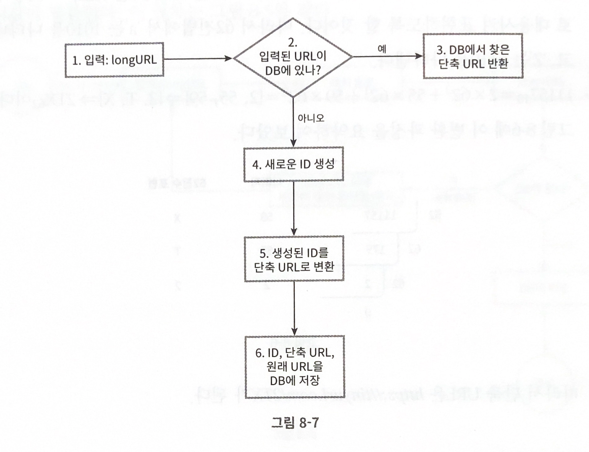

## 요구사항

- 주어진 url에 대해 단축 url을 결과로 제공하며, 단축 url에 접속하면 원래 URL로 접속됨
- 트래픽 규모는 매일 1억개
- 짧으면 짧을수록 좋음
- 사용 문자는 0~9, a~Z
- 단축된 URL은 삭제나 갱신되지 않음

## 계략적 추정

- 쓰기 연산: 매일 1억개의 단축 URL 생성
- 초당 쓰기 연산: 1억/ 24/ 3600 = 1160
- 읽기 연산: 읽기 연산과 쓰기 연산이 10:1이라고 가정. 읽기 연산은 초당 11600회 발생
- 10년간 운영시, 3650억 개의 레코드 보관해야함
- 축약 전 URL의 평균 길이를 100이라고 하면, 10년동안 필요한 용량은 36.5TB

# API 설계

- POST /api/v1/data/shorten
- GET /api/v1/shortUrl
    - 원래 URL = hastTable.get(단축 URL)
    - 301, 302 응답을 사용할 수 있음

URL 단축 해시 함수

- 사용할 수 있는 문자 갯수 = 62개
- 10년간 3650억개의 URL을 만들어야하는데,
- n = 7이면 3.5조개의 URL을 만들 수 있기 떄문에, hashValue는 7로 충분

해시 후 충돌 해소

- 손쉬운 방법은 잘 알려진 해시 함수(CRC32, MD5, SHA-1)을 사용하는 것
- 그러나 가장 짧은 해시값도 7보다 길어서 힘듦
- 첫 번째 해결 방법은 계산된 해시 값에서 처음 7개 글자만 사용하는 것
    - 충돌이 발생하면 충돌이 해소될 때까지 사전에 정한 문자열을 해시값에 덧붙인다.
    - 데이터베이스 질의를 해야해서 오버헤드가 크다.
        - 블룸 필터를 쓰면 줄일 수 있음
- 두 번째 방법
    - base conversion은 유용 → 문자 개수가 62니까 base-62변환을 하면 됨

)

개략적인 순서도

리디렉션 설계

1. 사용자가 단축 URL을 클릭한다.
2. 로드밸런서가 해당 클릭으로 발생한 요청을 웹 서버에 전달한다.
3. 단축 URL이 이미 캐시에 있는 경우에는 원래 URL을 바로 꺼도내서 전달한다.
4. 캐시에 없는 경우 데이터베이스에서 꺼낸다.
5. 꺼낸 URL을 캐시에 넣은 후 반환한다.

조금 더 이야기해볼만할 것

- 처리율 제한 장치
    - IP 주소를 비롯한 필터링 규칙
- 웹 서버의 규모 확장
    - stateless 계층이므로, 자유롭게 규모 조절 가능
- 데이터베이스의 규모 확장
    - 다중화 혹은 샤딩으로 규모 확장성 달성
- 데이터 분석 솔루션
    - 어떤 링크를 많이 클릭했는지, 언제 클릭했는지 등 분석 가능
- 가용성, 데이터 일관성, 안정성